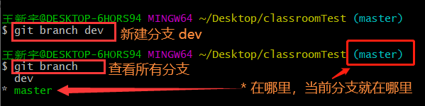

# 版本管理系统 (掌握Git)

> 记录每次代码的变更，以便将来查阅特定版本的修改情况
>
> 完成多人协作（必须配合远程仓库）

分类：

- 集中式（SVN、CVS、...）

  >集中式版本管理软件的特点是，**代码的版本集中到一个服务器上。**问题是，**如果没有网络或者服务器崩溃，将无法进行版本管理。** 

- 分布式（**Git、**HG、bazaar、...）

  >分布式版本管理软件的特点是，**代码的版本分布到每个计算机上。**99%的操作都是在自己的计算机上完成。


## Git 下载

> 官网下载地址：https://git-scm.com/


## Git 的配置

>用户名，理论上随意配置，但最好配置成和你的 码云、Github相同的用户名邮箱，理论上随意配置，但最好配置成和你的 码云、Github相同的邮箱

1. windows用户，在任何文件夹空白处，鼠标右键，打开 “Git Bash Here”; Mac用户打开终端窗口

2. 在出现的终端窗口中，输入 `git config --global user.name "xxx"` ，回车执行该命令，用以配置用户名

   ```cmd
   git config --global user.name "xxx"
   ```

3. 在出现的终端窗口中，输入 `git config --global user.email "xxx"` ，回车执行该命令，用以配置邮箱

   ```cmd
   git config --global user.email "xxx"
   ```

4. 再次输入，显示当前的用户名和邮箱，配置成功。

   


## 初始化本地仓库

> 初始化本地仓库后，项目才能被跟踪。
>
> 使用：
>
> 1. 在项目文件夹下打开 Git
> 2. 输入 `git init`
> 3. 在本地项目会有一个 .git 的隐藏文件夹，说明跟踪成功。

```cmd
git init
```


## Git 记录代码的更变

> 初始化 git 之后，记录每一次变更。

### Git 记录变更

> 每一次想要记录时，都要进行记录更变。
>
> **注意：add . 中间有空格** 

```cmd
git add .
git commit -m '要记录的名字'
```

### 查看变更记录

```cmd
git log
```

>**单行查看简略版日志** 
>
>```cmd
>git log --oneline
>```
>
>查看最近 n 次提交
>
>```cmd
>git log -n
>```
>
>**可以查看到当前版本之后的日志** 
>
>```cmd
>git log --reflog
>```
>
>- 也可以这样配合使用
>
> ```cmd
>git log --reflog --oneline
> ```
>
>==git log 更多选项参见官网：== [https://git-scm.com/docs/git-log](https://git-scm.com/docs/git-log)


**如果更变日志比较多，后面会出现代码输入提示，以 : 开头， ** 

- **按 ↓ 键，查看剩余日志。** 
- **按 q 键，退出。** 


### 回到历史版本

> **可以回到任意历史版本。** 
>
> - 版本号是40位长的一个字符串，它保证每个版本的版本号是唯一的。
> - 实际使用中，可以**只使用版本号的前几位即可，只要不重复就可以用。** 

```cmd
git reset --hard 版本号
```


## 查看文件状态

> 命令用于查看在你上次提交之后是否有对文件进行再次修改。

```cmd
git status
```

- 可以使用简短的输出，只显示文件

  ```cmd
  git status -s
  ```


### Git 三个区域

> **工作区  =>  add  =>  暂存区  =>  commit  =>  仓库区** 

#### 工作区

> 代码文件夹 - 写代码的地方。

#### 暂存区

> 代码更变后 - 暂时存放的区域。

#### 仓库

> 只有记录到本地仓库才能形成一个版本，代码才真正不会丢失。


## 添加提交命令

- ### 将工作区的改动添加到暂存区

  - 将工作区全部改动添加到暂存区

    ```cmd
    git add .
    ```

  - 指定文件添加到暂存区

    ```cmd
    git add <file>
    ```

- ### 将暂存区的文件提交到仓库

  - 全部提交到本地仓库，形成一个版本

    ```cmd
    git commit -m
    ```

  - 指定文件提交到本地仓库，形成一个版本

    ```cmd
    git commit <file> -m
    ```

- ### 直接将工作区的改动提交到本地仓库

  > **将工作区的改动更新到暂存区，同时提交到仓库。** 
  >
  > ==注意：不能提交新文件，对新增的文件无效。== 

  ```cmd
  git commit -a -m
  ```


## 撤销添加或提交

> 撤销，指的是将最后一次提交的内容撤销到暂存区、工作区；或者将刚刚暂存的内容撤销到工作区。

- ### 最后一次提交的内容  =>  暂存区

  - 撤销指定的文件

    ```cmd
    git reset <file>
    ```

  - 撤销全部文件

    ```cmd
    git reset .
    ```

- ### 暂存区  =>  工作区

  - 撤销指定文件

    ```cmd
    git checkout <file>
    ```

  - 撤销全部

    ```cmd
    git checkout .
    ```

- ### 最后一次提交的内容  =>  暂存区/工作区（相当于重置）

  >该命令后不能指定文件。

  ```cmd
  git reset --hard
  ```

- ### 回到历史版本、或在历史版本中穿梭

  ```cmd
  git reset --hard 版本号
  ```


## GIT删除指定的某次版本提交

```cmd
git log  // 获取提交信息
git rebase -i (commit-id)  // commit-id 为提交版本的 hash code
```


使用命令后，打开一个文件，将需要删除版本前面的pick改为drop


### 报错恢复

```cmd
$ git pull
You are not currently on a branch, so I cannot use any
'branch.<branchname>.merge' in your configuration file.
Please specify which remote branch you want to use on the command
line and try again (e.g. 'git pull <repository> <refspec>').
See git-pull(1) for details.
```

解决办法：

```cmd
首先git checkout -b temp
其次git checkout master
```

恢复到master repository的状态，然后就可以pull了


## 远程仓库

>本地仓库上传到远程仓库。

### 推送 / 上传

#### Https 方式推送

```cmd
# 本地仓库提交到远程仓库
## git remote add 远程仓库别名 远程仓库地址
git remote add origin 远程仓库地址

# 推送
## git push -u origin master
git push -u origin master
```


#### SSH 方式推送

> 如果使用 ssh ，则需要先配置一下秘钥对（一个公钥、一个私钥），配置一次，永久使用。

步骤一：生成 ssh 秘钥对

```cmd
ssh-keygen -t rsa -C "15713912912@163.com"

# 三次回车
# 生成的文件在：C:\Users\15713\
# id_rsa：私钥，id_rsa.pub：公钥
# 记事本打开 复制公钥
# 在 GitHub项目 => Settings => Deploy keys 粘贴公钥
```


步骤二：推送远程

```cmd
# 添加别名和远程地址，进行上传
git remote add origin 远程地址
git push -u 别名 master
```

> ==只有第一次需要配置别名和远程地址。== 
>
> **==配置完地址之后，以后只需要进行 git push 就可以进行上传远程仓库。==** 
>
> - ```cmd
>   git push  # 后面不需要输入别名
>   ```


### 克隆 / 下载

> **将代码从远程仓库下载到本地电脑。** 
>
> 远程仓库地址，可以在项目中的code中找到，选择 https 或 **ssh** 即可。

```cmd
git clone 远程仓库地址
```


==生成的是完整的项目文件，以仓库名进行命名的文件夹。== 


### 查看/ 删除远程仓库别名

#### 查看远程仓库别名

> 如果当前地址不正确或已经存在，可以使用 git remote -v 进行查看当前别名和地址

```cmd
git remote -v
```

#### 删除远程仓库别名

```cmd
git remote remove 别名
```


### 第 n 次上传仓库

> 如果当前地址不正确或已经存在，可以使用 git remote -v 进行查看当前别名和地址
>
> ==如果不是第一次上传仓库，则可以直接使用 git push 进行上传。== 

```cmd
# 查看当前别名
git remote -v
# 删除指定的别名
git remote remove

# 添加别名和远程地址
git remote add origin 远程地址
# 上传远程仓库
git push
```


## 分支

> 实际开发中，不在 master 主分支上进行开发，要创建新分支进行开发。

### 创建分支

> 会 copy 一份当前分支 到新的分支。

```cmd
git branch 新分支名字
```




### 切换分支

```cmd
git checkout 分支名
```

#### 创建并切换分支

```cmd
git checkout -b 分支名
```


### 删除分支

#### 删除本地分支

> 删除分支时，要切换到别的分支再删除。

```cmd
# 删除分支
git branch -d 分支名

# 强制删除分支
git branch -D 分支名
```

#### 删除远程分支

```cmd
git push origin --delete 分支名
```


### 合并分支

```cmd
git merge 分支名
```

#### 快进模式

> 默认是快进模式：两个分支，基于A分支创建B分支，A分支不做任何更改，在B分支新增内容，将B分支合并到A分支就是快进模式。


#### 三方合并

>==当 a分支 和 b分支 同时修改了同一个文件时，会出现合并冲突，需要进行代码的取舍，此时属于三方合并。== 
>
>> `<<<<< ` 代表当前分支。
>
>> `=====` 到 `>>>>>`之间：代表要合并的分支。


终止 merge

> 发生冲突时会出现 merge 情况，需要终止才能继续使用。

```cmd
git merge --abort
```

> CONFLICT：冲突


### 本地分支推到远程仓库

> 和推送分支一样，要推送谁就写谁的名字。

```cmd
git push -u origin 分支名
```


### 查看所有本地分支

> `*` 在哪里，说明当前分支就在哪里。

```cmd
git branch
```

### 查看所有分支信息

```cmd
git branch -av
```


### 别名配置

```cmd
# 进入配置文件
vim ~/.gitconfig
```

```cmd
# 编辑配置文件

[user]
	email = 15713912912@163.com
	name = wangsir
[alias]
	# cm 是别名
	cm = commit
[core]
	autocrlf = false
```

==配置完别名之后，就可以直接使用别名==

```cmd
git commit -m "初始化完成"

# 可以简写成

git cm -m "初始化完成"
```

 

## Git 忽略文件

> 在项目文件夹下创建 `.gitignore` 文件，这个文件夹下的文件推送远程仓库时会忽略不提交。
>
> 比如：`node_modules` 文件，可以直接使用 `npm i` 进行下载。


## 多人协作

>待补充

### 邀请成员


### 获取最新代码

> 直接使用 `git push` 无法直接推送本地仓库到远程，因为没有获取远程仓库最新代码。
>
> 获取远程仓库代码后，再进行 `git push` 推送本地代码。

```cmd
git pull
```


## git emoji

> 官网：https://gitmoji.dev/ 
>
> `git commit` 时使用 emoji 为本次提交打上一个 “标签”。

| emoji                                   | emoji 代码                   | commit 说明           |
| --------------------------------------- | ---------------------------- | --------------------- |
| :art: (调色板)                          | `:art:`                      | 改进代码结构/代码格式 |
| :zap: (闪电):racehorse: (赛马)          | `:zap:`  `:racehorse:`       | 提升性能              |
| :fire: (火焰)                           | `:fire:`                     | 移除代码或文件        |
| :bug: (bug)                             | `:bug:`                      | 修复bug               |
| :ambulance: (急救车)                    | `:ambulance:`                | 重要补丁              |
| :sparkles: (火花)                       | `:sparkles:`                 | 引入新功能            |
| :memo: (备忘录)                         | `:memo:`                     | 撰写文档              |
| :rocket: (火箭)                         | `:rocket:`                   | 部署功能              |
| :lipstick: (口红)                       | `:lipstick:`                 | 更新UI和样式文件      |
| :tada: (庆祝)                           | `:tada:`                     | 初次提交              |
| :white_check_mark: (白色复选框)         | `:white_check_mark:`         | 增加测试              |
| :lock: (锁)                             | `:lock:`                     | 修复安全问题          |
| :apple: (苹果)                          | `:apple:`                    | 修复 macOS 下的问题   |
| :penguin: (企鹅)                        | `:penguin:`                  | 修复 Linux 下的问题   |
| :checkered_flag: (旗帜)                 | `:checked_flag:`             | 修复 Windows 下的问题 |
| :bookmark: (书签)                       | `:bookmark:`                 | 发行/版本标签         |
| :rotating_light: (警车灯)               | `:rotating_light:`           | 移除 linter 警告      |
| :construction: (施工)                   | `:construction:`             | 工作进行中            |
| :green_heart: (绿心)                    | `:green_heart:`              | 修复 CI 构建问题      |
| :arrow_down: (下降箭头)                 | `:arrow_down:`               | 降级依赖              |
| :arrow_up: (上升箭头)                   | `:arrow_up:`                 | 升级依赖              |
| :construction_worker: (工人)            | `:construction_worker:`      | 添加 CI 构建系统      |
| :chart_with_upwards_trend: (上升趋势图) | `:chart_with_upwards_trend:` | 添加分析或跟踪代码    |
| :hammer: (锤子)                         | `:hammer:`                   | 重大重构              |
| :heavy_minus_sign: (减号)               | `:heavy_minus_sign:`         | 减少一个依赖          |
| :whale: (鲸鱼)                          | `:whale:`                    | Docker 相关工作       |
| :heavy_plus_sign: (加号)                | `:heavy_plug_sign:`          | 增加一个依赖          |
| :wrench: (扳手)                         | `:wrench:`                   | 修改配置文件          |
| :globe_with_meridians: (地球)           | `:globe_with_meridians:`     | 国际化与本地化        |
| :pencil2: (铅笔)                        | `:pencil2:`                  | 修复 typo             |


## window CMD 命令

### 新建文件

```cmd
# echo 文件名.后缀名
echo 1.txt

# 新建文件，并设置内容
# echo 内容文本>文件名.后缀名
echo 你好>1.txt
```

### 删除文件

```cmd
# rm 文件名.后缀名
rm 1.txt
```

### 编辑文件

> 编辑内容：输入 i
>
> 退出编辑：ESC
>
> 退出vi编辑器：shift + :   输入 q
>
> 保存并退出编辑器：shift + :  wq

```cmd
#vi 编辑器
## vi 文件名.后缀名
vi 1.txt

#vim 编辑器
## vim 文件名.后缀名
vim 1.txt
```

### 查看文件内容

```cmd
# cat 文件名.后缀
cat 1.txt
```

